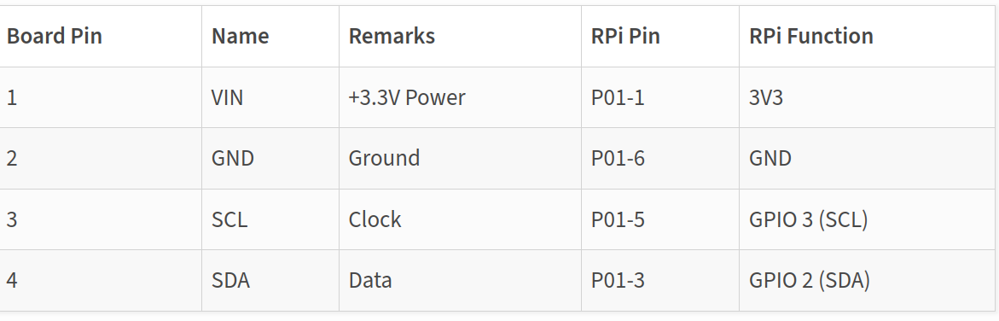
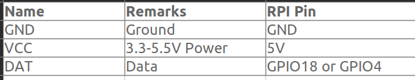

# Настройка проекта

### Датчик BME280
  - <https://www.donskytech.com/raspberry-pi-bme280-weather-station-using-python-and-flask/>
  - Необходимые пакеты:  
  <https://pypi.org/project/RPi.bme280/>    
  


### Датчик DHT22
 - Необходимые пакеты:  
 <https://learn.adafruit.com/dht-humidity-sensing-on-raspberry-pi-with-gdocs-logging/python-setup>
 - `sudo apt-get install libgpiod2`  
  

<br>
<hr>

### Настройка виртуальной среды
  - Create virtual environment:  
  `python -m venv <env name>`
  - Activate venv:  
  `source <env name>/bin/activate`

### Системные требования для установки mod-wsgi
 <https://www.digitalocean.com/community/tutorials/how-to-serve-django-applications-with-apache-and-mod_wsgi-on-debian-8>  
 <https://pypi.org/project/mod-wsgi/>  
`sudo apt install apache2 apache2-dev libapache2-mod-wsgi-py3`

### Установка библиотек перед установкой mysqlclient
<https://pypi.org/project/mysqlclient/>  
`sudo apt-get install python3-dev default-libmysqlclient-dev build-essential`

### Установка пакетов: 
`pip install -r requirements.txt`

### Создание файла requirements.txt:
`pip freeze > requirements.txt`

### Создание файла .env
Пример -  /config/.env-example

### Установка MariaDB
<https://www.digitalocean.com/community/tutorials/how-to-install-mariadb-on-ubuntu-20-04-ru>  
- установка MariaDB:  
  `sudo apt install mariadb-server`
- настройка MariaDB:  
  `sudo mysql_secure_installation`
- создание административного пользователя с аутентификацией по паролю:
  ```sh
  sudo mariadb
  GRANT ALL ON *.* TO 'admin'@'localhost' IDENTIFIED BY 'password' WITH GRANT OPTION;
  FLUSH PRIVILEGES;
  exit
  ```

### RabbitMQ брокер:
- установка  
  `sudo apt install rabbitmq-server`
- запуск  
  `systemctl enable rabbitmq-server`  
  `systemctl start rabbitmq-server`
- проверка статуса  
  `systemctl status rabbitmq-server`

### Настройка периодических задач с celery
<https://simpleisbetterthancomplex.com/tutorial/2017/08/20/how-to-use-celery-with-django.html>


<br>
<hr>

# Запуск проекта
## Development
- Запустить dev сервер:  
`python manage.py runserver`  
  или  
<https://dev.to/codewitgabi/how-to-view-a-django-project-across-other-devices-from-your-local-computer-43eg>  
`python manage.py runserver 0.0.0.0:8000`  
- Запустить воркер:  
`celery -A <name_of_project> worker -l info`
- Запустить beat:  
`celery -A <name_of_project> beat -l info`  
```sh
celery -A config worker -l info
celery -A config beat -l info
```

## Production
### Настройка деплоя с wsgi_mod  
<https://docs.djangoproject.com/en/4.2/howto/static-files/#deployment>  
<https://docs.djangoproject.com/en/4.2/howto/deployment/wsgi/modwsgi/>

 Добавить в файл /etc/apache2/sites-available/000-default.conf:
```
      Alias /favicon.ico /var/www/html/rpi-sensors/static/favicon.ico

      Alias /static/ /var/www/html/rpi-sensors/static/

      <Directory /var/www/html/rpi-sensors/static>
              Require all granted
      </Directory>

      <Directory /var/www/html/rpi-sensors/config>
            <Files wsgi.py>
                Require all granted
            </Files>
      </Directory>

      WSGIDaemonProcess django python-home=/var/www/html/rpi-sensors/venv python-path=/var/www/html/rpi-sensors
      WSGIProcessGroup django
      WSGIScriptAlias / /var/www/html/rpi-sensors/config/wsgi.py 
  ```

### Демонизация celery
<https://docs.celeryq.dev/en/stable/userguide/daemonizing.html#example-django-configuration>  
<https://seulcode.tistory.com/440>

- Создаем группу "celery"  
`sudo groupadd celery`
- Добавляем в группу пользователя "pi"  
`sudo usermod -aG celery pi`  
<https://losst.pro/kak-dobavit-polzovatelya-v-gruppu-linux>
<https://losst.pro/kak-dat-prava-na-papku-polzovatelyu-linux>

#### Создаем файл конфигурации /etc/systemd/celery.conf  
```sh
CELERYD_NODES="w1"

CELERY_BIN="/var/www/html/rpi-sensors/venv/bin/celery"

CELERY_APP="smart"

CELERYD_MULTI="multi"

CELERYD_OPTS="--time-limit=300 --concurrency=8"

CELERYD_PID_FILE="/var/run/celery/%n.pid"
CELERYD_LOG_FILE="/var/log/celery/%n.log"
CELERYD_LOG_LEVEL="INFO"

CELERYBEAT_PID_FILE="/var/run/celery/beat.pid"
CELERYBEAT_LOG_FILE="/var/log/celery/beat.log"
```

#### Создание директории для log и pid файлов  
Создаем systemd-tmpfiles файл для создания рабочих директорий для log и pid файлов
  
<https://www.freedesktop.org/software/systemd/man/latest/tmpfiles.d.html>


Файл: /etc/tmpfiles.d/celery.conf  
*#Type Path Mode User Group Age Argument…*
```sh
d /var/run/celery 0755 pi celery -
d /var/log/celery 0755 pi celery -
```

#### Создаем сервис для worker celery: /etc/systemd/system/celery.service
```sh
[Unit]
Description=Celery Service
After=network.target mariadb.service rabbitmq-server.service
Requires=mariadb.service rabbitmq-server.service

[Service]
Type=forking
User=pi
Group=celery
EnvironmentFile=/etc/systemd/celery.conf
WorkingDirectory=/var/www/html/rpi-sensors/
ExecStart=/bin/sh -c '${CELERY_BIN} -A $CELERY_APP multi start $CELERYD_NODES \
    --pidfile=${CELERYD_PID_FILE} --logfile=${CELERYD_LOG_FILE} \
    --loglevel="${CELERYD_LOG_LEVEL}" $CELERYD_OPTS'
ExecStop=/bin/sh -c '${CELERY_BIN} multi stopwait $CELERYD_NODES \
    --pidfile=${CELERYD_PID_FILE} --logfile=${CELERYD_LOG_FILE} \
    --loglevel="${CELERYD_LOG_LEVEL}"'
ExecReload=/bin/sh -c '${CELERY_BIN} -A $CELERY_APP multi restart $CELERYD_NODES \
    --pidfile=${CELERYD_PID_FILE} --logfile=${CELERYD_LOG_FILE} \
    --loglevel="${CELERYD_LOG_LEVEL}" $CELERYD_OPTS'
Restart=always

[Install]
WantedBy=multi-user.target
```

#### Создаем сервис для beat: /etc/systemd/system/celerybeat.service
```sh
[Unit]
Description=CeleryBeat Service
After=network.target mariadb.service rabbitmq-server.service
Requires=mariadb.service rabbitmq-server.service

[Service]
Type=simple
User=pi
Group=celery
EnvironmentFile=/etc/systemd/celery.conf
WorkingDirectory=/var/www/html/rpi-sensors/
ExecStart=/bin/sh -c '${CELERY_BIN} -A ${CELERY_APP} beat  \
    --pidfile=${CELERYBEAT_PID_FILE} \
    --logfile=${CELERYBEAT_LOG_FILE} --loglevel=${CELERYD_LOG_LEVEL}'
Restart=always

[Install]
WantedBy=multi-user.target
```

#### Перезапускаем сервисы

```sh
sudo systemctl daemon-reload
sudo systemctl start celery.service
sudo systemctl start celerybeat.service
```

Н астраиваем запуск сервисов при загрузке компьютера

```sh
sudo systemctl enable celery.service
sudo systemctl enable celerybeat.service
```

<https://www.digitalocean.com/community/tutorials/how-to-use-systemctl-to-manage-systemd-services-and-units-ru>


#### Обслуживание статических файлов на продакшн сервере 
<https://docs.djangoproject.com/en/4.2/howto/static-files/#deployment>

`
python manage.py collectstatic
`